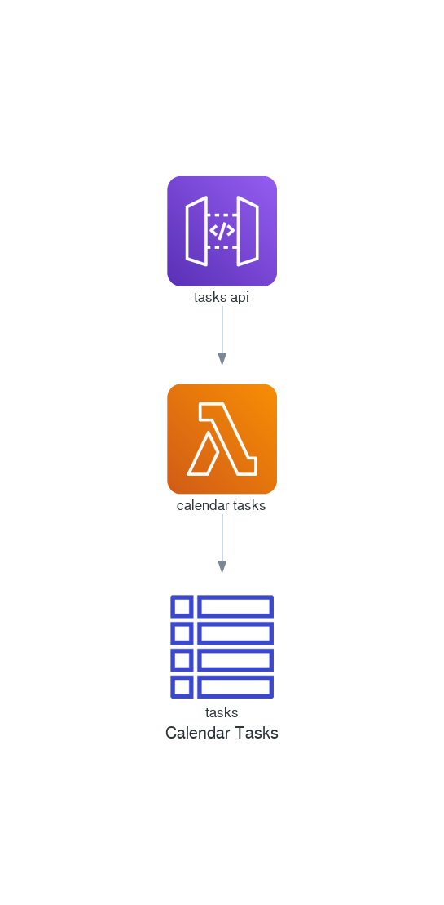

# Serverless Calendar Tasks

A task management function.



## Overview

Task management is useful for recording activities and tracking completion status. This can be managed by an
individual, team or organization in order to provide visibility and structure to necessary business processes.
Tasks may also be used to manage workflows between multiple actors (i.e. dependencies).

There are many use-cases for task management, including issue tracking, project management, performance goals,
etc. This function aims to remain reasonably generic such that as many use-cases as possible are supported.

### Revisions

A task may consist of multiple revisions representing changes to the recorded details. Each revision is
stored as a separate record in the database. The unique identifiers making up the composite key include:

* UID - Unique identifier for the journal entry (shared by all revisions of an entry)
* Sequence Number - Incremental revision identifier (indicates new revision of an entry)
* Recurrence ID - A timestamp identifier for specific instances of a recurring journal entry

### Attachments

A task may refer to one or more attachments via an external link (URL) or an inline base64 encoded binary.

### Comments

One or more comments can be associated with a task, which are defined via inline text or an external
reference (URL).

### Contacts

Multiple contacts may also be associated with a task. Contact information may be define as inline text
and/or an external reference (URI).

### Categories

Text-based labels or categories may be associated with a task. Categories may be used to group tasks by
project, type, label, etc. 

Such categories would be prefixed with a category type id:

* `project:<project_id`
* `task_type:<type_id>`
* `label:<label_id>`

### Related

Related calendar entries, journals or tasks may also be recorded against a task. An example of this may be
when a task represents an action of the recorded minutes (journal) for a meeting (event).

### Classification

Tasks may be classified as public, private or confidential, and may be used to control access and controls
applied to a task.


## Specification

### Input Event

The following JSON structure is used to create, update and retrieve tasks.

#### Create task

```
{
    "action": "compose",
    "summary": "A new task",
    "description": "A longer text description",
    "organizer": "John Doe",
    "categories": ["project:1", "task_type:story", "epic:2", "label:tech_debt"]
}
```

#### Create recurring task

```
{
    "action": "compose",
    "summary": "Complete Timesheet",
    "description": "Record time against activities",
    "organizer": "John Doe",
    "rrule": "FREQ=WEEKLY;BYDAY=FR"
}
```

#### Create entry revision

```
{
    "action": "revision",
    "uid": "1234",
    "summary": "A task update",
    "description": "A longer text description",
    "organizer": "John Doe"
}
```

#### Create entry recurrence revision

```
{
    "action": "revision",
    "uid": "1234",
    "recurrence-id": "20210214",
    "summary": "Week 1 - Timesheet",
    "description": "40 hours",
    "organizer": "John Doe"
}
```

#### List revisions

```
{
    "action": "list",
    "uid": "1234",
    "depth": "-1"
}
```

#### Entry search

```
{
    "action": "search",
    "from": "2020-01-01",
    "organizer": "johnd@example.com"
}
```

### DynamoDB

| PK                                           | SK                          | Name                  | Date       | Organizer         | Summary                            | Description             | Priority | Status   | Classification | URL                                     |
|----------------------------------------------|-----------------------------|-----------------------|------------|-------------------|------------------------------------|-------------------------|----------|----------|----------------|-----------------------------------------|
| TASK# `<uid>` # `<sequenceno>` # `<recurid>` | #METADATA#`<uid>`..         | -                     | 2021-03-01 | johnd@example.com | Complete Timesheet                 | Record tasks/time spent | 1        | COMPLETE | PUBLIC         | -                                       |
| TASK# `<uid>` # `<sequenceno>` # `<recurid>` | ATTACH#1                    | -                     | -          |                   | -                                  | -                       |          |          |                | https://files.example.com/timesheet.pdf |
| TASK# `<uid>` # `<sequenceno>` # `<recurid>` | CONTACT#1                   | John Doe              | -          |                   | -                                  | -                       |          |          |                | johnd@example.com                       |
| ORGANIZER#johnd@example.com                  | #METADATA#johnd@example.com | John Doe              |            |                   |                                    |                         |          |          |                |                                         |
| CATEGORY#project:1                           | #METADATA#project:1         | ACME Timesheet System |            |                   | Timesheet management for ACME inc. |                         |          |          |                |                                         |
| CATEGORY#label:work                          | #METADATA#label:work        | Work                  |            |                   | Work-related tasks                 |                         |          |          |                |                                         |
